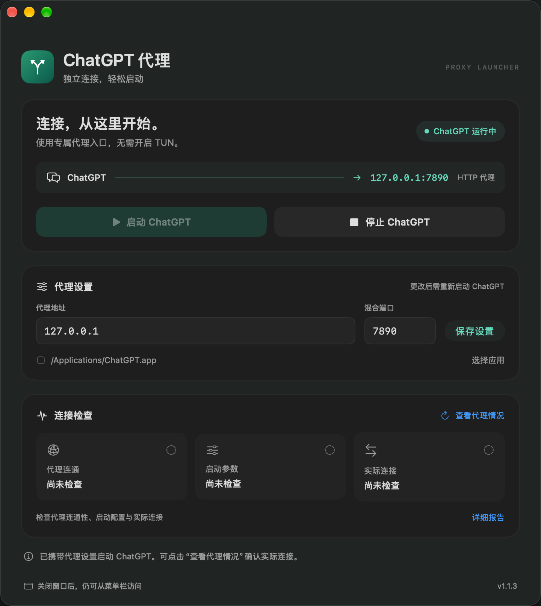
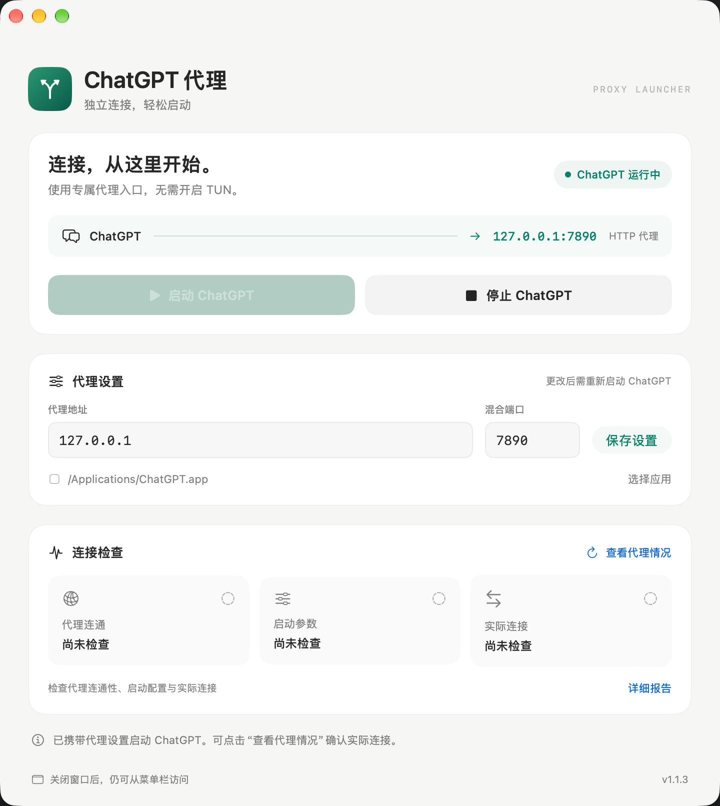

<h1 align="center">ChatGPT Proxy Launcher</h1>
<p align="center">独立连接，轻松启动 · 为 ChatGPT 单独配置代理的 macOS 原生启动器</p>

<p align="center">
  <a href="https://github.com/oliver804/ChatGPT-Proxy-Launcher/releases/tag/v1.0.0"></a>
  
  
  <a href="LICENSE"></a>
</p>
<p align="center">
  <b>简体中文</b> · <a href="README.en.md">English</a><br>
  <a href="https://github.com/oliver804/ChatGPT-Proxy-Launcher/releases/tag/v1.0.0">下载安装</a> ·
  <a href="#快速开始">快速开始</a> ·
  <a href="#常见问题">常见问题</a> ·
  <a href="https://github.com/oliver804/ChatGPT-Proxy-Launcher/issues">反馈问题</a>
</p>

## Preview

<table>
  <tr>
    <th width="50%">Dark</th>
    <th width="50%">Light</th>
  </tr>
  <tr>
    <td><a href="docs/images/preview-dark.png"></a></td>
    <td><a href="docs/images/preview-light.png"></a></td>
  </tr>
</table>

<sub>截图展示早期界面，当前开源发布版本为 v1.0.0。</sub>

## 简介

如果你使用 Clash Verge 等代理工具，希望 ChatGPT 通过本地代理连接，又不想为了一个应用开启 TUN、影响其他网络工具，这个启动器可以帮你单独配置 ChatGPT 的代理入口。

它通过应用支持的启动参数与环境变量设置代理，不修改系统代理或 DNS。使用 SwiftUI + AppKit 开发，无第三方运行时依赖。

## 功能

- **独立代理**：保存地址与端口，支持无需认证的 HTTP 代理和 Clash 混合端口。
- **启动与停止**：携带代理配置启动 ChatGPT，也可请求其正常退出。
- **连接检查**：查看代理连通性、实际启动参数和应用 TCP 连接。
- **菜单栏操作**：随时启动、停止或查看状态；关闭主窗口后隐藏 Dock 图标。
- **原生界面**：支持浅色、深色外观；中文界面，中英文项目文档。

## 下载与安装

| 版本 | 运行环境 | 下载 |
| --- | --- | --- |
| **v1.0.0** | Apple Silicon · macOS 13+ | [下载 DMG](https://github.com/oliver804/ChatGPT-Proxy-Launcher/releases/download/v1.0.0/ChatGPT-Proxy-Launcher-1.0.0-arm64.dmg) |

打开 DMG，将 **ChatGPT Proxy Launcher** 拖入 **Applications（应用程序）**。[发布页面](https://github.com/oliver804/ChatGPT-Proxy-Launcher/releases/tag/v1.0.0)同时提供源码包和 SHA-256 校验文件。

> 仅支持可识别的 **Electron 版 ChatGPT**，不支持旧版原生应用；当前安装包不支持 Intel Mac。

## 快速开始

1. 保持 Clash Verge 等代理程序运行，确认其 HTTP / 混合端口可用。
2. 在启动器填写代理地址与端口，例如 `127.0.0.1` 和 `7890`，点击 **保存设置**。
3. 完全退出已经运行的 ChatGPT，再点击 **启动 ChatGPT**。
4. 点击 **查看代理情况** 检查连接，按需打开详细报告。

**修改配置后需要重启 ChatGPT，后续也请通过启动器打开。** 从 Dock 直接打开 ChatGPT，不会自动附带这里保存的代理配置。

关闭主窗口后，仍可从菜单栏操作。退出启动器不会停止已运行的 ChatGPT。

## 常见问题

<details>
<summary><b>首次打开被 macOS 拦截怎么办？</b></summary>

当前安装包使用 ad-hoc 本地签名，尚未经过 Apple Developer ID 签名或公证。确认来自本项目发布页面后，可在 **系统设置 → 隐私与安全性** 中允许打开，无需关闭 SIP 或系统安全检查。

</details>

<details>
<summary><b>还需要开启 TUN 吗？所有流量都会走代理吗？</b></summary>

兼容的 ChatGPT 应用可直接使用本地代理端口，无需依赖 TUN 或系统代理。代理程序本身仍需运行；启动器不会自动修改它的设置。

主要覆盖 Chromium 的 HTTP、HTTPS 和 WebSocket 请求，并禁用 QUIC。语音、WebRTC、UDP，以及不识别代理环境变量的子进程不保证经过代理；ChatGPT 或 Electron 更新后，代理行为也可能变化。

</details>

<details>
<summary><b>如何理解连接检查结果？</b></summary>

| 检查项 | 含义 |
| --- | --- |
| 代理连通 | 经指定代理建立 CONNECT 隧道并获得 TLS 网站响应 |
| 启动参数 | ChatGPT 主进程携带与当前配置匹配的代理参数 |
| 实际连接 | 快照中观察到应用或子进程到代理的 TCP 连接 |

HTTP 403 只能说明隧道与 TLS 检查取得了响应，不代表聊天或账号可用。连接检查是即时快照，不能证明全部流量都经过代理；没有观察到连接也不代表直连。域名代理地址可能无法与快照中的数字 IP 匹配。

</details>

<details>
<summary><b>如何更新应用？</b></summary>

从菜单栏退出启动器，再用新版本替换“应用程序”中的旧版本。已有代理设置会保留，无需停止 ChatGPT。

</details>

## 开发与构建

需要 Apple Silicon Mac、Xcode Command Line Tools（Swift 5.9+）和 Python 3。

```sh
make check       # 隐私与脚本检查
make test        # 核心测试
make build       # 构建应用
make dmg         # 生成 DMG、源码 ZIP 和校验文件
make verify      # 验证安装包、签名与图标
```

应用输出到 `build/release/`，发布文件输出到 `dist/1.0.0/`。[`VERSION`](VERSION) 是构建版本的唯一来源。

`make integration`、`make ui` 需要已登录的 macOS 图形会话，仅操作独立测试应用与窗口；`make previews` 可生成模拟数据界面预览。

欢迎提交 [Issue](https://github.com/oliver804/ChatGPT-Proxy-Launcher/issues) 或 PR。开发细节参见[贡献指南](CONTRIBUTING.md)、[架构说明](docs/ARCHITECTURE.md)和[发布指南](docs/RELEASING.md)。

## 隐私与许可证

无账号登录、遥测或自动上传；配置保存在本机。连接检查会经指定代理向 `chatgpt.com` 发起不携带账号凭据的 HEAD 请求。诊断报告在本地显示，分享前请移除私人路径、内部地址等敏感信息。[隐私说明](docs/PRIVACY.md) · [安全问题](SECURITY.md)

**作者：Oliver** · [oliver804x@gmail.com](mailto:oliver804x@gmail.com)<br>
**许可证：[MIT](LICENSE)** · [更新日志](CHANGELOG.md)

独立开源项目，与 OpenAI 无隶属关系。ChatGPT 等名称属于其各自权利人，参见[第三方说明](THIRD_PARTY_NOTICES.md)。
